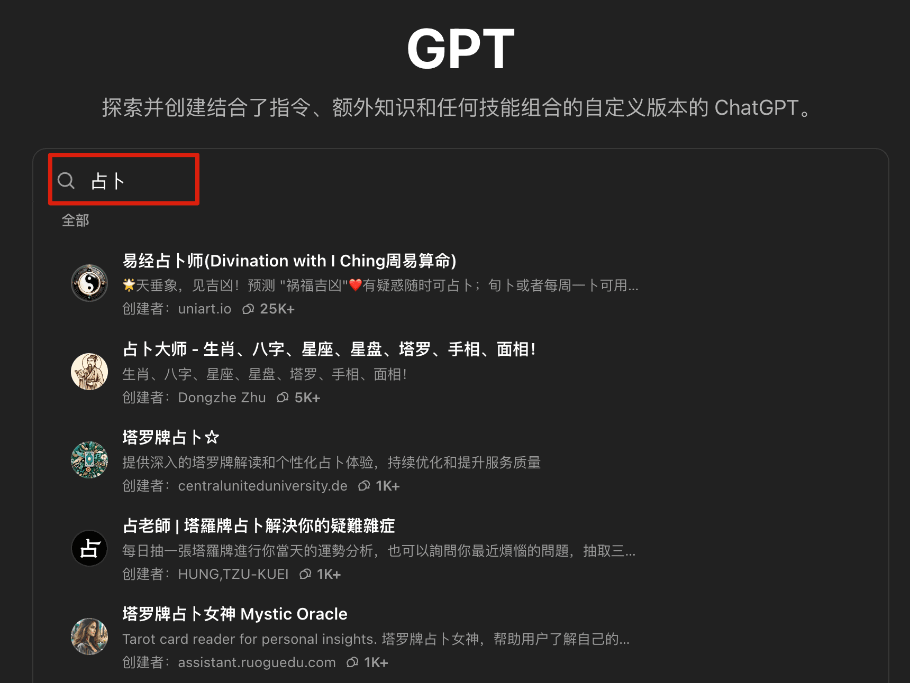

## 什么是GPTs商店？

**官方的定义**：You can now create custom versions of ChatGPT that combine instructions, extra knowledge, and any combination of skills.

简单来说，任何人，都可以量身定做属于自己的拥有各种场景的GPT版本。上面我给大家演示的GPTs，就是ChatGPT官方为了演示其强大的功能所定制的GPTs **DALL·E**，然后分享出来的，所有用户都可以使用，现在GPTs商店种定制GPT的数量已经超200万了。

## 怎么使用GPTs商店？

打开 GPT Store 的方式非常简单：

**第一步**：登录你的 ChatGPT中文站 账号；

**第二步**：点击开始使用ChatGPT

**第三步**：点击页面左上角位置的**“探索 GPT”**。

接下来，你就进入到 GPT Store 的主界面（如下图）。

你既可以直接点击上面的“热门 GPT”，也可以在搜索栏输入关键词，比如【占卜】，从而找到想要的 GPT。

与开通了ChatGPT中文站订阅的用户相比，普通版的用户 账号：

⭕️ 不支持创建 GPTs 角色；
⭕️ 无法持续使用 GPT-4/GPT-4o 模型进行对话。

不过，目前 GPT Store 里有**近 800w 个 GPT**，使用次数**超过 100 的**也有 **60w 左右**。

非常值得大家去探索。

接下来，我们就为大家推荐 8 个好用、好玩的 GPTs。

## GPTs推荐

### Cartoonize Yourself（制作卡通头像）

可以把你的照片变成卡通版本。

### 占卜大师（生肖、八字、星座、星盘、塔罗、手相、面相）

可以看生肖、八字、星座、星盘、塔罗、手相、面相

### 小红书爆款专家

提供小红书最新实时数据并撰写高质量小红书内容策略与种草文本。

### 八字算命

结合紫微斗数、八字排盘，并通过大量用户真实反馈校准，日益精确。

### 知网降重

帮助降低中文论文重复率，保持内容一致性

### Scholar AI（文献搜索）

AI科学家——从2亿多篇研究论文和书籍中搜索和分析文本、图像和表格，以生成新的假设。以前是ScholarAI插件

### 论文润色大师

